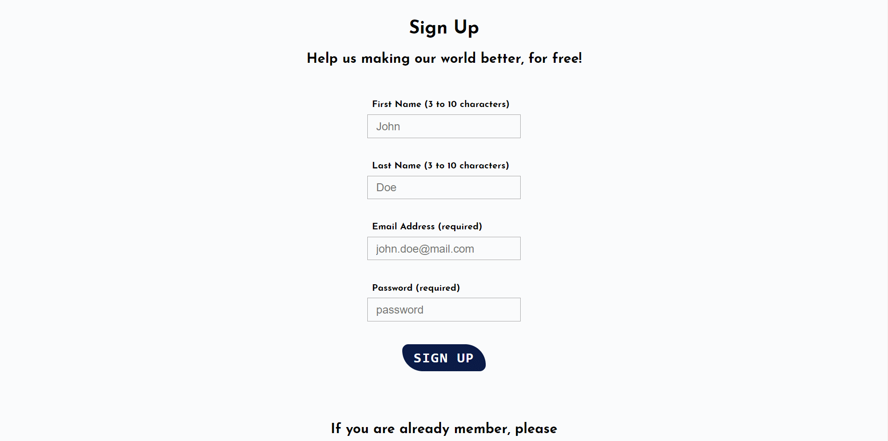
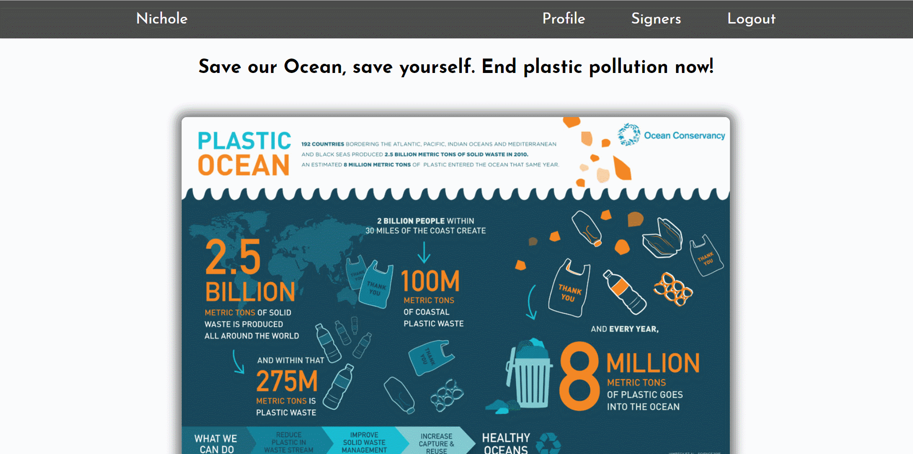
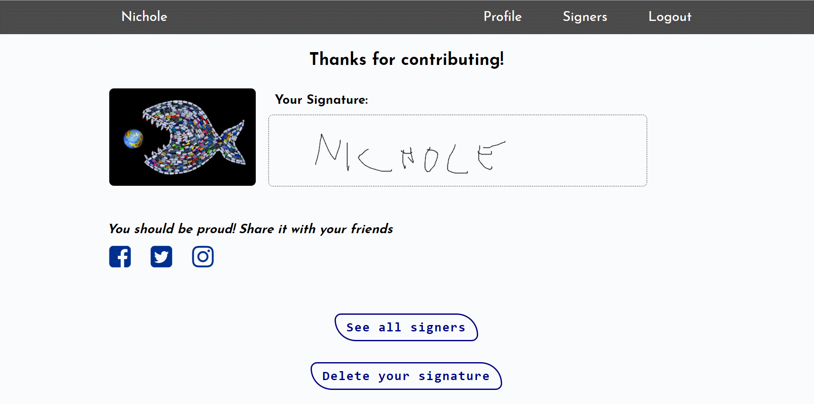
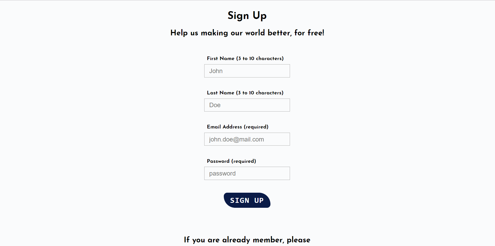

# Global Pollution Petition

### Table of contents

*   [Website](#website)
*   [Overview](#overview)
*   [Description](#description)

### Website

[End Plastic Pollution](https://global-petition.herokuapp.com)

### Overview

Online petition that people can sign to make their voice heard. 
Full stack project, covering both server-side and client-side. Main technologies used:
*   jQuery
*   Handlebars JS
*   Express JS
*   PostgreSQL
*   Redis

### Description

You need to register first. You are also allowed to login with your previous credentials, if you have an account already.

After logging in, read what the petition is about and sign for it using your mouse.
You will then see how your signature has been saved into database, and you can check all other signers for that petition.
An animated progress bar shows the signers percentage until the the target petition is achieved.

Finally you can update your credentials, as well as your password.

When users try to log in with bad credentials more than 3 times, then a timeout won't allow to login anymore until the "punish time" has ended.
The "punish time" will double every time user tries to login again!

